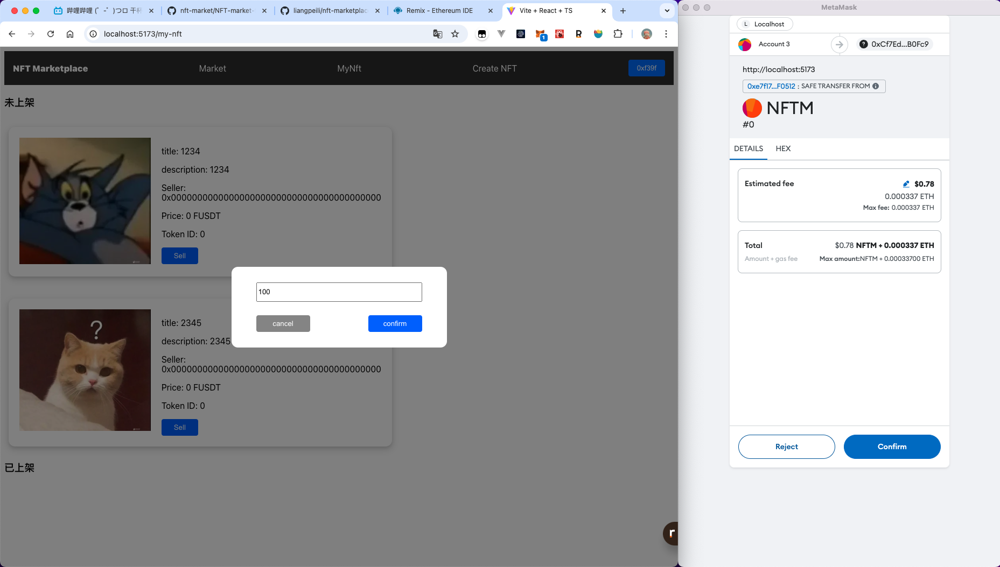

# nft-market
## description
bulid your own nft market(just for learning)


## environment
node.js v21.4.0

solidity | ether.js | hardhat | react | ts | node.js | ipfs | remix

## 1 deploy contracts
```bash
  cd ./NFT-market-contract

  yarn install

  # generate local eth blockchain
  npx hardhat node

  # remix connect local filesystem
  #(note: remember to change your own path)
  remixd -s /Users/wei/program/web/nft-market/NFT-market-contract -u https://remix.ethereum.org
```

  in remix, select the environment which is "Dev Hardhat Provider"

  compile & deploy the three contracts to your local eth blockchain 
  (note: you must deploy erc20-usdt.sol and erc721-nft.sol first, because the nft-market.sol need to use the address of them)

## 2 run backend server
```bash
  cd ./NFT-market-backend

  # install ipfs （os：macOS）
  brew install ipfs

  # start ipfs daemon
  ipfs daemon

  # install dependencies
  pnpm install

  # replace the NFT_CONTRACT_ADDRESS in the .env file

  # run backend server
  pnpm run dev

  # then you can test the api in postman
  # successful response:
  {
    "message": "file uploaded successfully",
    "metadata": {
        "title": "test",
        "description": "test",
        "image": "http://127.0.0.1:8080/ipfs/QmZ71ghUHZ5E7X3DhjqZJwucbgSpCzCT8BeHmyhepkW4Mw/IMG_5014.jpeg"
    }
  }
```

## 3 run frontend
```bash
  cd ./NFT-market-frontend

  pnpm install

  # replace the ADDRESSES in the .env.development file

  pnpm run dev
```

## nft-market preview




## reference
https://www.bilibili.com/video/BV1by4y1A7M7/?spm_id_from=333.999.0.0&vd_source=e571088ad909ca40753c88b512657ce7